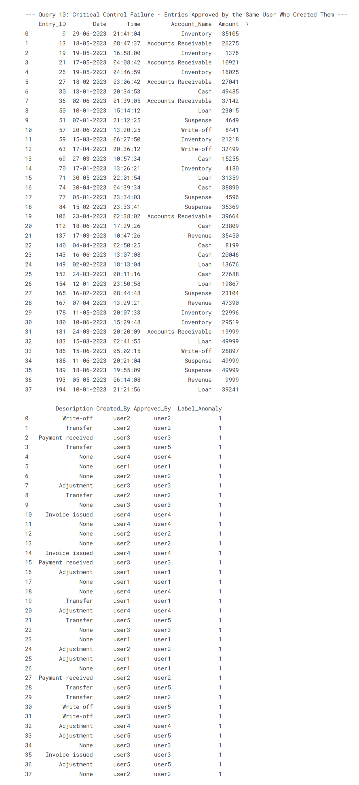

# 🧾 Journal Entry Anomaly Detection Using SQL 

A rule-based SQL framework to identify anomalous journal entries in financial data. Built to support audit teams, internal controls testing, and fraud detection efforts—fully transparent, standards-aligned, and ready for integration into enterprise audit environments.

> 📌 Practical audit use-case  
> 🧠 Pure SQL 
> ✅ Aligned with ISA 240, 315, 330

---

## 🎯 Objective

This project implements an **SQL-based anomaly detection framework** for journal entries, simulating what internal audit teams or forensic consultants would use in real-world financial audits. It focuses on data-driven red-flag identification with rule clarity, audit traceability, and no dependencies outside SQL.

---
## 💼 ISA Standards Applied
| Standard | Relevance |
|----------|-----------|
| **ISA 240 – Fraud** | Flags for unusual timing and approval patterns enhance fraud detection. |
| **Risk-Based Audit** | SQL-based anomaly scoring enables focused testing of high-risk entries. |
| **Control Design Review** | Detection logic helps identify control gaps (e.g., self-approved entries). |

---

## 🧰 Tools & Standards
- **DuckDB** + SQL – performant in-memory querying of Pandas-like tables
- **Pandas** – for data handling
- **Kaggle (Python Notebook)** – for reproducible analytics workflow
---

## 📂 Dataset Overview

- General Ledger journal entries simulated via Kaggle-provided synthetic data  
- Fields include: `Entry ID`, `Date`, `Time`, `Account Name`, `Amount`, `Description`, `Created_By`, `Approved_By`, `Label_Anomaly`
- Suitable for simulating mid-sized ERP systems (e.g., SAP, Oracle)

---

## 🔍 Detection Logic — 10 Red Flags

| No. | Red Flag Description | Rationale |
|-----|-----------------------|-----------|
| 1 | Journal entries with amounts above threshold | Indicates potential override or high-risk transaction |
| 2 | Weekend or holiday postings | Outside normal business operations |
| 3 | Multiple entries posted by same user within short span | May suggest override, batch fraud |
| 4 | Frequently Recurring Transaction Amounts| Lack of audit trail |
| 5 | Entries with Missing or Blank Descriptions | Dummy or misposted entries |
| 6 | Unauthorized Approvals on Sensitive Accounts| Indicates possible misclassification |
| 7 | Transactions with Suspicious Dates (Future or Very Old)| May indicate split transactions or suppression |
| 8 | Benford's Law Analysis| First Digit Distribution|
| 9 | Analysis of Round Number Transactions| Unusual journal structure or incorrect classification |
| 10 | Entries affecting P&L and balance sheet simultaneously | Potential unauthorized access |

---

## 🔁 Solution Workflow

1. **Data Setup**
   - Load CSV, ensure `Date` is cast as a DATE type.
   - Register as a DuckDB table (`journal_entries`).

2. **Anomaly Logic via SQL**
   - Out-of-hours or weekend entries  
   - Self-approved postings (`Created_By = Approved_By`)  
   - Rounded amounts suggesting manual entry  
   - Blank descriptions  
   - Suspense or write-off account entries  

3. **Aggregate Anomaly Scores**
   - Construct a risk score vectorized via SQL, then convert to a DataFrame for review.

---

## 📦 Files Included

- `normalize_entries.sql` — Prepares and cleans raw journal data  
- `detect_redflags.sql` — Applies the 10 red flag detection rules  
- `export_flagged.sql` — Formats flagged entries for reporting or dashboards  
- Sample data for validation and rule testing

---

## 📷 Screenshots of the SQL Output

- Top 10 Highest Value Transactions
  
- Transactions Posted on a Weekend
  
- Top 10 Users by Number of Entries Made
  
- Frequently Recurring Transaction Amounts (Potential Automation/Error)
  .png)
- Entries with Missing or Blank Descriptions
  
- Unauthorized Approvals on Sensitive Accounts
  
- Benford's Law Analysis (First Digit Distribution)
  .png)
- Critical Control Failure - Entries Approved by the Same User Who Created Them
  
- Final Analysis: Top 15 Entries with Highest Anomaly Scores
  

---

## 💼 Use Case Scenarios

- Internal Audit Journal Entry Testing  
- External Audit Support (ISA 240-based testing)  
- SQL Reviews – Manual Journal Entry control testing  
- Forensic Pre-Screening for Investigations

---

## 📈 Business Value

- Enables proactive fraud detection and internal control monitoring  
- Reduces audit testing population via focused red-flag logic  
- Transparent, reproducible logic for regulatory review  
- No-code logic—accessible to both data teams and auditors

---

## 🛠️ Suggested Enhancements

- Integrate into **BI dashboards** (Power BI, Tableau)  
- Apply **risk weighting** and materiality thresholds  
- Add **cross-period trend comparison** (e.g., Q/Q anomalies)  
- Link flagged entries to **audit working papers**

---

## 🔎 Key Insights & Findings

**⭐ Control Weaknesses & Policy Violations:**

• Segregation of Duties (SoD) Violations: A critical control failure was identified where the same user who created a journal entry also approved it. The output from "Query 10" lists numerous instances of this, indicating a significant weakness in internal controls that could be exploited.

• Transactions on Weekends: "Query 2" reveals that a substantial number of transactions were posted on Saturdays and Sundays. While this might be legitimate for some businesses, it often warrants further investigation to ensure these are authorized activities.

• Incomplete Documentation: A significant number of entries have missing or blank descriptions, as shown in "Query 5". This is a poor data governance practice that hinders audit trails and transaction understanding.

**⭐ Potential Anomalies & Errors:**

• High-Value Transactions: "Query 1" flags the top 10 highest value transactions, with amounts as high as 49,999. These large transactions, especially in accounts like "Suspense" and "Write-off," should be scrutinized.

• Recurring Transaction Amounts: "Query 4" identified that the amount 9999 appeared 6 times. This could indicate potential automation errors, or it might be a pattern that requires a business explanation.

• Benford's Law Deviations: The "First Digit Distribution" from "Query 8" shows some deviations from the expected pattern of Benford's Law. For example, the digit '1' appears 27.0% of the time, while '2' appears 19.0% and '4' appears 20.5%. These might suggest non-natural or manipulated numbers.

**⭐ Summary of Anomalous Transactions:**
The "Final Analysis" provides a consolidated view of the riskiest transactions by combining several anomaly flags. The top entries with the highest anomaly scores exhibit a combination of issues, such as being created and approved by the same user and having no description.

---

## Recommendations

1. Investigate SoD Violations: Immediately review all transactions where the creator and approver are the same to check for impropriety. The "user1," "user3," and "user5" appear frequently in these instances.
2. Review Weekend Activity: Examine the nature of transactions posted on weekends to confirm their validity and business necessity.
3. Enforce Data Entry Standards: Implement mandatory descriptions for all journal entries to improve transparency and auditability.
4. Scrutinize High-Value and Recurring Amounts: The largest transactions and the frequently recurring amount of 19999 should be investigated to ensure they are legitimate.
5. Analyze Benford's Law Results: A deeper statistical analysis of the first digit distribution could provide more conclusive evidence of data manipulation.

---

## ⚡ Conclusion

This project demonstrates how targeted, rule-based SQL analytics can surface high-risk journal entries with precision and audit traceability. By operationalizing 10 ISA 240-aligned red flag tests, it bridges the gap between raw ERP data and actionable audit evidence.
The findings highlight recurring patterns of anomalies—often concentrated around specific users, timeframes, and transaction types—underscoring the importance of robust control environments, access governance, and real-time monitoring.

In a professional audit context, this framework can:

-Accelerate risk-based sampling

-Strengthen fraud detection procedures

-Support regulatory compliance and management assurance

In short, this repository is not just a proof of concept—it’s a deployable audit asset that can be adapted across industries and ERP platforms to proactively identify and address financial reporting risks.

---
## 👤 Author
Ashik Thomas,

ACCA Part Qualified
